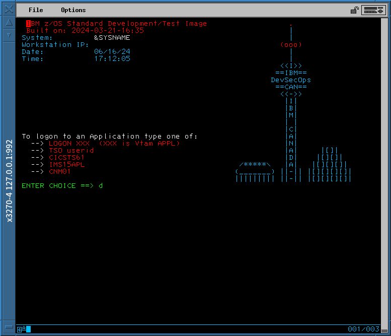

# Z31VS1.CCKD

https://archive.org/details/zos31_version1

## Screenshots

## Starting

SYS0.IPLPARM has 6 members. LOADAU, LOADA0, LOADGK, LOADK2, LOADNZ, LOADZT.
`IPL DE27 LOADPARM DE28A0`

If I respond to DSI802A CNM01 with "R 0003, CLOSE DUMP", I won't be able to access the logon UI.

## Shutting down

Go to [wiki](https://github.com/imyaman/Z31VS1.CCKD/wiki)

## Network

Go to [wiki](https://github.com/imyaman/Z31VS1.CCKD/wiki)
